<!--
See also pandoc-crossref: is a pandoc filter for numbering figures, equations, tables and cross-references to them.
https://lierdakil.github.io/pandoc-crossref/
-->

# Introduction
Ce rapport est réalisé dans le cadre de la validation d'une Unité d'enseignement
d'intelligence artificielle. Le jeu implémenté est le
Puissance 4, disponible au lien
<https://github.com/JulioJu/ArtificialIntelligenceConnectFourGame>.

L'objectif du projet est de réaliser un jeu multijoueur dans le langage de son
choix et d'implémenter plusieurs intelligences artificielles dont
au minimum une heuristique, l'algorithme minimax et l'élagage alpha-bêta.

Ce rapport se divise en deux parties. La première partie concerne la
présentation générale du jeu implémenté, c'est-à-dire les règles du jeu, le
choix des technologies et la structuration de l'implémentation réalisée. La
deuxième partie est consacrée à la présentation et la comparaison des
différentes intelligences artificielles.

\newpage
# Présentation du jeu implémenté

## Règles du jeu
Le Puissance 4, appelé couramment *Connect four* en anglais,
est un jeu à deux joueurs destiné à des enfants de 6 ans et
plus[@PuissanceJeuSociete] ;
ce jeu est donc très facile d'accès. Il se compose d'une grille
de sept colonnes par six lignes, suspendue verticalement, ainsi que de 42 disques de deux
couleurs différentes, une pour chaque joueur (généralement rouge et jaune).
Au début du jeu, la grille est vide. À tour de rôle, chaque joueur doit jeter
un pion de sa couleur du sommet d'une des six colonnes. Comme le proclame
une publicité des années 70, le but du jeu est simple : « *Connect
four of your checkers in a row while preventing your opponent from doing the
same. But, look out -- your opponent can sneak up on you and win the
game!* »[@themuseumofclassicchicagotelevisionwww.fuzzymemories.tvConnectFourPretty]

Il appartient à la catégorie des « jeux de stratégie
combinatoire abstrait »[@wikipediacontributorsListAbstractStrategy2019 ,
(note: dans cet article comme les jeux non
combinatoires sont classés dans une section à part, on en déduit que c'est
un jeu combinatoire)]. Ainsi il peut utiliser la « théorie des jeux
combinatoires »[@wikipediacontributorsAbstractStrategyGame2019].
Ce type de jeux présente plusieurs caractéristiques intéressantes
pour la création d'une intelligence artificielle. Il s'agit d'un jeu à information
parfaite[@wikipediacontributorsCombinatorialGameTheory2019]: l'état du jeu courant
est connu par chacun des joueurs, ce qui permet d'éviter d'ajouter à
l'IA la charge de faire des hypothèses sur l'état courant du jeu, comme au pocker par
exemple[@wikipediacontributorsCompleteInformation2019]
(notons que l'article Wikipédia en français confond les notions de jeu à
information parfaite et de jeu à information
complète[@wikipediacontributorsJeuStrategieCombinatoire2019]^, ^[@wikipediacontributorsTheorieJeuxCombinatoires2019]).
Les IA pour les jeux à information non parfaite sont beaucoup plus difficiles à mettre en place,
aucune IA n'a encore battu les humains au bridge pour cette raison, par exemple[@demichelisremyCesJeuxQui2018].
Une autre caractéristique des « jeux de stratégie combinatoire abstrait » est que le hasard n'intervient
pas[@wikipediacontributorsListAbstractStrategy2019], ce qui permet d'évaluer les
IA sans biais liés au hasard. Mettre en avant le fait que le Puissance 4
est un « jeu de stratégie combinatoire abstrait » permet de savoir que
les IA liées à ce jeu sont d'une relative simplicité par rapport aux IA des jeux
de stratégie non combinatoire.

Dans le domaine de la théorie des jeux[@wikipediacontributorsGameTheory2019], le
Puissance 4 est un jeu à somme nulle[@wikipediacontributorsConnectFour2019].
La valeur numérique de l'intérêt du joueur à effectuer un mouvement est exactement la même
que la valeur du préjudice porté au joueur adverse. Il donc possible
d'utiliser l'algorithme minimax[@wikipediacontributorsZerosumGame2019].

Comparé à d'autres jeux, comme les échecs, le Puissance 4 est un jeu relativement peu
gourmand, en termes de ressources, pour une intelligence artificielle. Chaque nœud dispose
de 4 enfants au maximum, alors qu'aux échecs, il est de 35. La longueur moyenne
d'un jeu est de 36 plis au Puissance 4 alors qu'il est environ du double aux
échecs. La complexité de l'arbre de jeu,
sur une échelle de log de base 10, est de 21
au Puissance 4 et 123 aux échecs[@wikipediacontributorsGameComplexity2019].
Même si le Puissance 4 est plus simple que les échecs, il y a 4 500 milliards
de positions possibles[@wikipediacontributorsConnectFour2019],
et 2 000 milliards de possibilités pour aligner quatre disques de même couleur[@newmanHereHowWin],
d'où l'impossibilité de réaliser une exploration totale de l'arbre de jeu.

## Choix des technologies
Ce projet a été écrit avec uniquement les technologies web côté client, à savoir
Vanilla JavaScript, HTML et Css et peut être ouvert dans n'importe quel
navigateur internet.  J'ai avant tout choisi ces technologies car je les
maîtrisais bien et souhaitais continuer à renforcer mes compétences.
De plus, je m'étais aperçu que tous les navigateurs, et notamment Firefox,
disposent de très puissants outils de développement. Dans la Console
Firefox, il est possible de voir à quel élément visuel correspond un objet (voir
\autoref{fig:ConsoleHeuristic} à la page
\autopageref{fig:ConsoleHeuristic}). Cela s'est révélé très utile, voire
essentiel, pour débugger facilement les intelligences artificielles. Par
exemple pour minimax, nous pouvons retracer tout l'arbre de jeu de manière
visuelle (voir \autoref{fig:ConsoleMinMax} à la
\autopageref{fig:ConsoleMinMax}). Et enfin, j'ai choisis ces
technologies pour préparer le plus efficacement possible mon entrée sur
le marché du travail, car le développement web est un des secteurs les
plus porteurs actuellement en France.

Le terme « Vanilla
JavaScript » indique qu'aucune bibliothèque ou Framework n'a été
utilisé pour ce projet. Comme l'indique le site internet <vanilla-js.com>,
on obtient de meilleures performances[@VanillaJS]. À
l'utilisation, je me suis aperçu que les Framework, tels JQuery, ajoutent une
couche d'abstraction peu utile de nos jours, surtout quand on maîtrise la
manipulation native du [Document Object
Model](https://en.wikipedia.org/wiki/Document_Object_Model).

Plus précisément, j'ai écrit ce programme en TypeScript, un langage de
programmation open-source développé et maintenu par
Microsoft[@wikipediacontributorsTypeScript2019]. Le langage
TypeScript, comme son nom l'indique, peut être vu comme du
JavaScript avec des informations de typage. Tout programme JavaScript est un
programme TypeScript. Le TypeScript ajoute simplement des sucres syntaxiques au
JavaScript[@AnyJavaScriptCode]. Sans rien enlever au
JavaScript, il l'étend pour apporter tous les avantages aux langages à
typage non dynamique[@tomaszewskijackWhyTypeScriptBest2018].
De plus, il permet de disposer d'un puissant moteur
d'autocomplétion, ce qui améliore grandement la facilité de programmation[@langservercontributorsLangserverOrg2019].
Ainsi le processus de transpilation de TypeScript en JavaScript peut-être vu
comme un simple mécanisme qui supprime les informations de typage et autres
sucres syntaxique du fichier[^1].

## Structuration du programme
Ce projet est structuré autour des deux seules pages web du projet:

1) La page de
formulaire
[index.html](https://github.com/JulioJu/ArtificialIntelligenceConnectFourGame/blob/master/app/index.html)
et [ses fichiers de script correspondants
](https://github.com/JulioJu/ArtificialIntelligenceConnectFourGame/tree/master/app/typescript/index)
(voir copie d'écran \autoref{fig:ScreenshotIndexHtml} à la \autopageref{fig:ScreenshotIndexHtml} ).
Il permet de choisir les options du jeu (mode multijoueur, IA contre humain, ou
IA contre IA), les intelligences artificielles du joueur rouge et jaune, etc. ;

2) [La page du puissance 4](https://github.com/JulioJu/ArtificialIntelligenceConnectFourGame/blob/master/app/connect-four-game.html) et
[ses fichiers de script
correspondants](https://github.com/JulioJu/ArtificialIntelligenceConnectFourGame/tree/master/app/typescript/connect-four-game)
(voir \autoref{fig:ScreenshotConnectfourGameHtml} à la \autopageref{fig:ScreenshotConnectfourGameHtml}).
Ces scripts implémentent la totalité du jeu Puissance 4
et peuvent exister sans la page index.html. Les paramètres du jeu peuvent être
modifiés grâce
[aux paramètres de l'URL](https://en.wikipedia.org/wiki/Query_string).
    * Par défaut, le jeu est multijoueur. Pour déclencher l'IA, il suffit
        d'appuyer sur la touche « c », ce qui est très pratique pour tester
        rapidement ses IA.
    * Les intelligences artificielles sont situées
        [dans leur propre dossier nommé « artificial-intelligence »](https://github.com/JulioJu/ArtificialIntelligenceConnectFourGame/tree/master/app/typescript/connect-four-game/artificial-intelligence).
        Leur rôle est de retourner simplement une case à partir de
        l'état courant du jeu.
    *  Dans Le fichier
        [constant.ts](https://github.com/JulioJu/ArtificialIntelligenceConnectFourGame/blob/master/app/typescript/connect-four-game/constants.ts),
        il est possible de modifier le nombre de lignes et de colonnes du jeu
        ainsi que le nombre de pièces à aligner pour qu'un joueur
        gagne. Cette option comporte de nombreux avantages.
        Cela s'est avéré très utile lors de la mise en place des
        intelligences artificielles, par exemple pour diminuer la profondeur ou
        la largeur de l'arbre. De plus, cela montre que les intelligences
        artificielles sont pensées de manière abstraite, simplement en prenant
        en considération les propriétés découlant de la position relative
        de chaque pièce. Cela permet également de conclure que les algorithmes
        ne sont pas liés à un état de jeu particulier (il n'est par exemple pas
        écrit que le premier coup doit se jouer sur la colonne 4 : ce mouvement
        est déduit de l'heuristique). Enfin, on peut aussi jouer à la variante
        officielle « 5-in-a-Row »
        (6 lignes fois 9 colonnes et 5 pièces à aligner)[@wikipediacontributorsConnectFour2019].

Le fichier [README.md](https://github.com/JulioJu/ArtificialIntelligenceConnectFourGame)
du projet est plutôt destiné à présenter ce que j'ai appris dans les
technologies du web.

\newpage
# Les Intelligences artificielles

## Random
L'option « Play randomly » est implémentée dans Le dossier
« [artificial-intelligence/random](https://github.com/JulioJu/ArtificialIntelligenceConnectFourGame/blob/master/app/typescript/connect-four-game/artificial-intelligence/random/) ».
L'unique fichier de ce dossier ne contient qu'une seule ligne de code « utile »,
nécessaire pour déterminer aléatoirement quelle case jouer, ce qui montre
que le code est très bien factorisé. Avec cette option de jeu,
l'ordinateur ne joue pas de manière
« intelligente »[@wikipediacontributorsIntelligenceArtificielle2019], mais seulement de manière
aléatoire. Elle peut être utilisée comme étalon pour comparer en combien de
temps elle est battue par les autres intelligences artificielles.

Même s'il ne s'agit pas d'une intelligence artificielle, cette option
met en œuvre un algorithme de recherche. En effet, elle résout un problème
de recherche en récupérant une information calculée dans un espace de recherche[@wikipediacontributorsSearchAlgorithm2019].
Certes, la solution n'est souvent pas la meilleure, mais reste juste.

## Win-lost-random
L'option « Win-lost-random » est implémentée dans le dossier
« [artificial-intelligence/win-lost-random](https://github.com/JulioJu/ArtificialIntelligenceConnectFourGame/blob/master/app/typescript/connect-four-game/artificial-intelligence/win-lost-random/) ».
Comme son nom l'indique, cette intelligence artificielle joue une case gagnante,
ou sinon une case qui empêcherait le joueur adverse de joueur, si elle existe.
Sinon elle joue de manière aléatoire.

On voit que l'unique fichier de ce dossier contient très peu de lignes de code
(le cœur de la fonction compte seulement 13 lignes),
ce qui montre une fois de plus que le code est très bien factorisé.

Contrairement à la précédente option,
nous sommes en présence d'une vraie  « intelligence »
artificielle même si elle est simple . Elle pourrait peut-être gagner des
humains, notamment un jeune enfant, car
contrairement à un humain, l'ordinateur ne peut pas faire de fautes
d'inattention.  À ce titre, on peut qualifier cet algorithme d'« intelligence »
artificielle, si on prend sa définition
dans son sens le plus vaste[@wikipediacontributorsIntelligenceArtificielle2019], du fait qu'elle
« simule » une intelligence. Notons que les algorithmes liés aux jeux
bénéficient assez facilement du qualificatif « intelligence artificielle »
(un simple algorithme Minimax est qualifié d'IA[@wikipediacontributorsMinimax2019]),
alors que dans d'autres domaines, notamment celui du business, des critiques
qualifient seulement « d'intelligence artificielle » seulement les programmes
mettant en œuvre de l'apprentissage automatique — *machine learning*[@businessAnthonyMorelAttention].

En revanche, ce n'est absolument pas une heuristique, car
les choix de jeu offerts à l'ordinateur ne sont pas
scorés[@wikipediacontributorsHeuristicComputerScience2019].


## Heuristique \label{sec:heuristique}
Les options « heuristique » sont implémentées dans le dossier
« [artificial-intelligence/heuristic](https://github.com/JulioJu/ArtificialIntelligenceConnectFourGame/tree/master/app/typescript/connect-four-game/artificial-intelligence/heuristic) ».
Au premier coup d'œil, on remarque que ce dossier est plus conséquent
que les précédents cités. Il contient 428 lignes de code (hors commentaires
et lignes blanches) répartis dans différents fichiers.

Comme on peut le lire sur la
\autoref{fig:ScreenshotIndexHtml} à la \autopageref{fig:ScreenshotIndexHtml}, il existe
plusieurs heuristiques. Une première prend
en considération les lignes horizontales ; une deuxième, les lignes
diagonales nord-ouest / sud-est ; une troisième, les lignes verticales ;
une quatrième les lignes nord-est / sud-ouest. Elles ont été importantes
pour le débuggage.
Enfin, la dernière heuristique analyse le jeu dans
ces quatre directions, et ceci se constate dans le code
(voir [« ai-heuristic.ts » lignes 109 à 154](https://github.com/JulioJu/ArtificialIntelligenceConnectFourGame/blob/511e381ac6855a707a704aa878a38d1a5c6897ab/app/typescript/connect-four-game/artificial-intelligence/heuristic/ai-heuristic.ts#L109,L154) ).

Un schéma est plus parlant que de longs discours :
les explications sur le fonctionnement de cette heuristique sont présentées
en \autoref{fig:HeuristicAlgorithm} à la
\autopageref{fig:HeuristicAlgorithm}. J'ai beaucoup expérimenté en faisant varier
la manière dont les scores devaient être attribués, ainsi que leur valeur, pour
déterminer les meilleures combinaisons.

Comme on peut le lire à la \autoref{fig:HeuristicAlgorithm}
un score est attribué à chaque case jouable,
et la pièce est placée sur la case qui reçoit le meilleur score. On
est donc bien en présence d'une « fonction heuristique » (ou « heuristique »).
En effet, cette fonction « *ranks alternatives in search algorithms at each
branching step based on available information to decide which branch to
follow* »[@wikipediacontributorsHeuristicComputerScience2019].

Pour chaque case jouable, l'heuristique commence par détecter si le joueur actif
peut gagner. Si c'est le cas, le disque du joueur est immédiatement placé
sur la case, sans que les cases qui n'ont pas encore été testées soit testées
(la boucle est interrompue). Cela peut se constater dans la copie d'écran
\autoref{fig:ConsoleHeuristicRedPlayB1AndWin},
page \autopageref{fig:ConsoleHeuristicRedPlayB1AndWin}, et dans
[le code correspondant](
https://github.com/JulioJu/ArtificialIntelligenceConnectFourGame/blob/511e381ac6855a707a704aa878a38d1a5c6897ab/app/typescript/connect-four-game/artificial-intelligence/heuristic/ai-heuristic.ts#L121).
Pour l'algorithme minimax sans
l'élagage alpha-bêta, ce phénomène ne se produit pas.

Dans la \autopageref{fig:HeuristicAlgorithm}, l'heuristique évite que le
joueur adverse puisse gagner au coup suivant.
Cela se produit quand trois pions de la couleur adverse
sont déjà alignés (voir la copie d'écran
\autoref{fig:ConsoleHeuristicYellowPlayB1RedWillNoWin},
page \autopageref{fig:ConsoleHeuristicYellowPlayB1RedWillNoWin}
et le code correspondant dans le fichier
[ai-heuristic.ts](https://github.com/JulioJu/ArtificialIntelligenceConnectFourGame/blob/511e381ac6855a707a704aa878a38d1a5c6897ab/app/typescript/connect-four-game/artificial-intelligence/heuristic/ai-heuristic.ts#L157,L160)).
Cette propriété n'est pas utilisée dans l'algorithme minimax présentée
dans la section suivante (\autoref{sec:minimax}, page \autopageref{sec:minimax}).
L'heuristique déclenchée à une profondeur de 4
ne prend pas en considération ce qui se passe à la profondeur 5.

Deux optimisations sont utilisées
uniquement dans l'option
« Heuristic for horizontals, verticals and diagonals », mais
pas pour les autres heuristiques ni pour minimax et alpha-bêta pruning.
Celles-ci optimisation se déclenchent dans le cas où
le joueur actif n'a pas un mouvement gagnant ou si l'adversaire
ne risque pas de gagner au coup suivant. La première optimisation évite
d'offrir la victoire à l'adversaire (
\autoref{fig:ScreenshotHeuristicYellowShouldPlayF1}
à la \autopageref{fig:ScreenshotHeuristicYellowShouldPlayF1} et son
[code dans le fichier ai-heuristic.ts](https://github.com/JulioJu/ArtificialIntelligenceConnectFourGame/blob/511e381ac6855a707a704aa878a38d1a5c6897ab/app/typescript/connect-four-game/artificial-intelligence/heuristic/ai-heuristic.ts#L140,L144)).
La seconde vise à préparer un coup gagnant (\autoref{fig:ScreenshotHeuristicRedShouldPlayF1}
à la \autopageref{fig:ScreenshotHeuristicRedShouldPlayF1} et son
[code dans le fichier ai-heuristic.ts](https://github.com/JulioJu/ArtificialIntelligenceConnectFourGame/blob/511e381ac6855a707a704aa878a38d1a5c6897ab/app/typescript/connect-four-game/artificial-intelligence/heuristic/ai-heuristic.ts#L144,L152)).

En écrivant le rapport, en clarifiant mes schémas
(\autoref{fig:HeuristicAlgorithm}), je m'aperçois que cette
heuristique ne paraît pas très logique et inutilement complexe. Pour
attribuer les scores dans le fichier `build-BlocResult.ts`, probablement
qu'il aurait été plus judicieux de ne considérer que le nombres de disques
du joueur actifs, ou le nombre de disques de l'adversaire, et le nombre de
cases vides.

Globalement cette heuristique  marche bien et elle a réussi à battre plusieurs fois des personnes
contre qui je l'ai fait jouer.
Mais si on en connaît les limites, il est assez simple de la vaincre. Comme cette heuristique ne peut pas
empêcher le joueur adversaire de gagner de quatre coups à l'avance, elle
est facilement battue, ainsi que le montre \autoref{fig:ScreenshotHeuristicRedWillLose} à la page
\autopageref{fig:ScreenshotHeuristicRedWillLose}. L'algorithme minimax devrait permettre de
résoudre ce genre de limitations.

Conformément aux consignes, je n'ai pas recherché des solutions toutes faites, ce qui m'a
pris beaucoup de temps pour trouver quelque chose de satisfaisant. Il existe
pourtant de fameuses solutions ; on peut citer, par exemple, celle implémentée dans le
célèbre test « Fhourstones » incorporé dans le logiciel de benchmark Phoronix Test
Suite[@wikipediacontributorsFhourstones2019], ou même une thèse d'informatique
entièrement dédiée à ce sujet, soutenue par Victor Allis en
1988[@allisvictorKnowledgebasedApproachConnectFour1988], ou plus récemment une
présentation illustrée édité par l'université MIT[@ConnectFour2010]).

## Minimax et élagage alpha-bêta \label{sec:minimax}

Les options « minimax » et « alpha-bêta » sont implémentées dans le fichier
[depth-exploration.ts](https://github.com/JulioJu/ArtificialIntelligenceConnectFourGame/blob/master/app/typescript/connect-four-game/artificial-intelligence/depth-exploration/depth-exploration.ts)
car ils partagent tous le code écrit dans ce dossier.

### Minimax sans optimisation

Comme précisé plus haut, le Puissance 4 est un jeu à somme nulle.
Il est donc possible d'implémenter l'algorithme Minimax.

Le fonctionnement de l'algorithme minimax n'est pas expliqué ici, si ce n'est
en creux, car cela dépasserait le cadre du rapport.

<!--
- Expliquer le principle. Expliquer les arbres de branchements.

- On suppose que le joueur joue les coups optimaux.
Le noms de coups possible. Arbre de hauteur: nombre de colonnes ^ k (k hauteur
- de l'arbre)
- Tableau montrant pour chaque hauteur les nombres de scénarios possible.
    Estimation de la durée en faisant l'hypothèse que l'ordi fait un million de
    coup par secondes.

- Faire une estimation de la hauteur moyenne d'un arbre. Faire jouer les
- heuristiques et voir en combien de coups
-->


#### Sans heuristique

Pour bien appréhender le problème et pour utiliser une méthode de programmation
incrémentale, j'avais commencé à implémenter un algorithme
minimax sans heuristique. Ce n'est d'ailleurs pas à proprement parler un algorithme
minimax, puisque minimax nécessite une fonction heuristique à faire tourner
à la profondeur max. L'option « minimax without heuristic » attribue la valeur
zéro à toutes les feuilles non gagnantes. Les plis impairs représentent
le joueur actif, les scores sont donc positifs. Les plis pairs représentent
le joueur adverse, les scores sont donc négatifs.

Pour un état de jeu donné (donc un nœud), si le joueur actif gagne — pli impair —,
le nœud prend la valeur + 1 ; si l'adversaire gagne — pli pair —, le nœud prend la valeur - 1.
Dans ces deux cas, ce nœud n'a pas de fils (voir \autoref{fig:MinimaxWinLost},
\autopageref{fig:MinimaxWinLost}).

Même si aucune heuristique n'est implémentée, elle gagne l'option « win-lost-random »
présentée plus haut car elle « réfléchit »
plusieurs coups à l'avance en fonction des critères « gagne ou perd ». Cependant,
comme elle ne développe aucune stratégie liée à une heuristique, elle est facilement
gagnable. Si cette heuristique avait une profondeur de 41
plis[@tomaszewskijackWhyTypeScriptBest2018],
elle permettrait au premier joueur de gagner tout le temps. Mais avec
un ordinateur personnel même très puissant
l'ordinateur met environs 6 secondes pour jouer, et au 9\textsuperscript{e} pli, il met déjà
plusieurs minutes et se termine avec une exception `out of memory`
(voir \autoref{tab:minimaxWithoutHeuristicComparaison} à la \autopageref{tab:minimaxWithoutHeuristicComparaison}).

Cette fonction heuristique retourne presque tout le temps la valeur zéro, à moins
que le joueur actif n'ait un coup gagnant au prochain mouvement (profondeur 1).
Pour qu'elle retourne un score - 1 ou 1, obtenu pour un nœud
de profondeur supérieure stricte à 1,  il ne doit rester aucune
chance au joueur actif ou à l'adversaire de gagner quels que soient
les mouvements effectués par les joueurs, même ceux paraissant illogiques.
Pour des profondeurs de 8 ou moins, on devine que cela ne peut arriver en début
du jeu. J'ai ajouté une situation de jeu pour laquelle le score retourné n'est
pas « 0 ». Elle a été réalisée grâce à une petite « amélioration » présentée en
\autoref{fig:MinimaxWinLostWithOptimization}
à la \autopageref{fig:MinimaxWinLostWithOptimization} (ne fonctionne
que pour l'option « minimax without heuristic »).

#### Avec heuristique

L'option « minimax with heuristic » a le même fonctionnement
que l'option « minimax without heuristic » présentée ci-dessus, à une exception près.
Si la fonction récursive atteint la profondeur
max, et que celui qui doit jouer au niveau max ne gagne pas,
l'heuristique indiquée à la \autoref{sec:heuristique} est déclenchée. L'ajout
de cette heuristique ralentit le fonctionnement de l'algorithme
minimax, surtout sur les profondeurs hautes où le nombre de
feuilles est beaucoup plus importante (voir les résultats numériques sous la \autoref{sec:numericResults})
à la page \autopageref{sec:numericResults}).

Pour éviter que le joueur actif n'ait de scores négatifs, le
nombre 999 est ajouté au score retourné par l'heuristique. De même, pour que
l'adversaire n'ait pas de scores positifs, le nombre 999 est soustrait au score
retourné par l'heuristique. Pour bien les distinguer,
les nœuds gagnants pour le joueur actif ont un score de + 200 000, ceux
pour le joueur adverse ont un score de - 200 000.

<!--
4 bis) On rajoute un paramètre random.
    Pour la rendre moins déterministe. On ajoute alatoirement des points (ou on
    en enlève)
-->
### Élagage alpha-bêta

L'algorithme minimax dispose d'une optimisation très facile à mettre en place.
Il suffit d'élaguer — ne pas explorer — les branches qui ne peuvent donner de
résultats avec une valeur absolue supérieure à celui d'une branche déjà
explorée. C'est le cas uniquement si l'on trouve une branche gagnante (scores
+ 200 000 et - 200 000)

L'algorithme alpha-bêta est celui utilisé pour résoudre le Puissance 4
dès les années 80[@allisvictorKnowledgebasedApproachConnectFour1988, p.6].

L'option « alpha-bêta pruning without heuristic » est le résultat de
la combinaison de l'option « minimax without heuristic » et de cette optimisation « élagage alpha-bêta ».
L'algorithme est schématisé à la
\autoref{fig:AlphaBetaWithoutHeuristic},
\autopageref{fig:AlphaBetaWithoutHeuristic}.

De même, l'option « alpha-bêta pruning with heuristic » est
la combinaison de l'option « minimax with heuristic » et de cette optimisation « élagage alpha-bêta ».

Pour prendre connaissance des temps d'exécution, on peut consulter la section
suivante. C'est qu'à une profondeur 8 que l'humain pourra se rendre compte
d'une petite amélioration de la rapidité (2 minutes au lieu de 2 minutes
20 sans optimisation alpha-bêta pruning).

## Résultats numériques \label{sec:numericResults}

Le temps d'exécution de chaque IA mesure uniquement la fonction où est définie
l'IA
 (voir [le fichier
« computer-turns.ts »](https://github.com/JulioJu/ArtificialIntelligenceConnectFourGame/blob/master/app/typescript/connect-four-game/computer-turn.ts)).
Le temps de l'animation n'est bien entendu pas pris en compte.  Pour
mesurer le temps d'exécution, il ne faut pas oublier de paramétrer le navigateur
de manière adéquate (à l'heure actuelle, par défaut, les mesures de temps sont
peu précises dans les navigateurs et au bout de 10 secondes d'exécution,
le script est interrompu, lire le
[README.md](https://github.com/JulioJu/ArtificialIntelligenceConnectFourGame#performancenow-accuracy)).

Comme présenté en \autoref{fig:ConsoleStatistics},
\autopageref{fig:ConsoleStatistics}, le temps mis par chaque coup est
imprimé en Console.

Lors de mes expérimentations, je me suis aperçu que sous Firefox le moteur
JavaScript était en moyenne environ trois fois plus lent si la Console était
ouverte que si elle était fermée. Lors des comparaisons, il faut donc prendre
garde à conserver le même contexte de mesure, au risque de tirer des conclusions
erronées. Pour ma part, j'ai choisi d'effectuer toutes mes mesures avec la
Console fermée, puis d'ouvrir la Console une fois que le coup a été joué.

J'ai également remarqué que sous Firefox 66 comme sous Chromium 73, avec un profil
réinitialisé, sans modules complémentaires installés, sans onglets ouverts,
sans autres logiciels ouverts, le temps d'exécution pouvait varier considérablement.
Sous Firefox 66, avec l'option « Heuristic for horizontals, verticals and
diagonals », Console fermée, j'ai constaté qu'il variait de 4 ms à 14 ms.
Pour l'option « random » j'ai mesuré des valeurs de 0.14 à 0.7 ms.
Je ne comprends pas pourquoi parfois les résultats varient, et je me demande
si lancer plusieurs fois l'heuristique et faire une moyenne du temps d'exécution
augmenterait la précision de la mesure. En effet, si c'est l'homme qui le lance
de manière aléatoire, on ne peut pas prendre en considération
les résultats obtenus car l'homme est très mauvais pour faire du vrai aléatoire.
La meilleure solution serait probablement de déclencher plusieurs fois l'heuristique
automatiquement, pendant une heure sans toucher à l'ordinateur, et d'établir au final une
moyenne des temps d'exécution.
Pour l'étude des performances des algorithmes, on apprécie les limites du
JavaScript — un langage de très haut niveau —, utilisé dans le contexte
d'exécution d'un navigateur web. Probablement qu'un langage de bas niveau comme
le C serait plus pertinent.

J'utilise le système d'exploitation Linux avec la distribution Arch Linux.  Arch
Linux ne souffre pas d'embarquer un ensemble de
services activés par défaut (indexations, mise-à-jour, antivirus, etc.), contrairement à d'autres distributions Linux, comme Debian et Ubuntu, et
à fortiori, contrairement à d'autres systèmes d'exploitation, comme Mac OS
ou Microsoft Windows. Pour
effectuer des mesures de performances, Arch Linux est donc supérieur car il
est moins dépendant d'un contexte d'exécution dont on n'a pas la maîtrise.
Bien entendu, il ne s'agit pas d'un système d'exploitation temps réel.

Les caractéristiques de l'ordinateur sur lequel les mesures ont été faites sont présentées
en annexe \autoref{sec:computerCaracteristics}, \autopageref{sec:computerCaracteristics}.

La comparaison de la rapidité des différents algorithmes de base ne paraît donc
pas très pertinent. On peut seulement ajouter quelques indications sur certains
algorithmes pour se faire une idée globale du coup de chacun, mais
sans pour autant en tirer des conclusions précises sur les différences ; ce sont seulement des tendances. Les valeurs minimum
et maximums constatées ne doivent pas être prises en considération.
 Rien ne dit qu'au bout de x+1 essais j'aurais trouvé des extrêmes plus étalés. De
plus, j'ai arrondi les valeurs.  Les tests ont été parfois effectués après
un vidage de la cache, parfois sans.

Les mesures sont prises dans l'objectif de parvenir à des conclusions,
elles ne sont pas exhaustives.

### Minimax

Les résultats suivants permettent de constater que le temps d'exécution
 est plus qu'exponentiel en fonction de la profondeur de
l'algorithme minimax.  Ils ont été mesurés pour le premier
coup. Au Puissance 4, le premier joueur peut gagner au 7\textsuperscript{e} coup si
l'adversaire joue mal. À partir de la profondeur 7, l'arbre minimax
commence à avoir des feuilles.


| 4           | 5           | 6            | 7                  | 8                   | 9                                               |
| --          | --          | --           | --                 | --                  | --                                              |
| 30 à 70 ms  | 50 à 90 ms  | 160 à 220ms  | 1 seconde environ  | 6 secondes environ  | out of memory exception  after several minutes (5 squares parsed)  |
Table: Temps d'exécution de premier coup avec l'option « Minimax without heuristic ». \label{tab:minimaxWithoutHeuristicComparaison}

Comme je l'ai explicité dans le
[README.md](https://github.com/JulioJu/ArtificialIntelligenceConnectFourGame),
l'exception `out of memory` est probablement dû au fait que j'ai conservé en
mémoire la totalité de l'arbre minimax créé car je le `console.log`. Comme je
l'ai expérimenté, imprimer un objet en console empêche que le `garbage
collector` le supprime. De toute façon, arrivé au niveau 9, l'IA met déjà
plusieurs minutes pour fonctionner, elle n'est donc pas utilisable
dans un jeu contre un humain. De manière générale, mes algorithmes ont été
conçus pour faciliter la phase de développement, il ne sont donc pas très optimisés,
et par exemple le code est très factorisé au détriment de l'optimisation.

Pour « minimax **with** heuristic », avec une profondeur de 6, les mesures sont
autour de 6 secondes. Nous pouvons en déduire que le temps mis par l'exécution
de l'heuristique à la profondeur maximum est peu élevé. En revanche, pour une
profondeur de 8, au premier coup, où il y a 6 634 026 dont 5 686 266 feuilles,  le temps
d'exécution est d'environ 140 ms (1 minute 20).

r 4               | 5               | 6                   | 7                    | 8             | 9                        |
| --              | --              | --                  | --                   | --            | --                       |
| 150 ms environ  | 500 ms environ  | 6 secondes environ  | 20 secondes environ  | 2 minutes 20  | out of memory exception  |
Table: Temps d'exécution de premier coup avec l'option « Minimax with heuristic ». \label{tab:minimaxWithHeuristicComparaison}

### Alpha-bêta

L'optimisation de minimax, « l'élagage alpha-bêta » peut apporter de meilleures
performances mais ne peut en aucun cas permettre à l'intelligence artificielle
de gagner plus souvent. D'après les mesures que nous avons prises, à une
profondeur 9, cette optimisation ne permet pas d'avoir des temps raisonnables de
calculs (plusieurs dizaines de minutes). Comme précisé plus haut, à une
profondeur 7 au premier coup alpha-bêta pruning n'apporte aucune optimisation
pour les raisons énoncées plus haut.

Pour la profondeur 8, le nombre de nœuds explorés est de 5 950 771, et le nombre
de feuilles de 5 078 875. On remarque donc que l'optimisation alpha-bêta
pruning permet d'explorer environ 700 000 nœuds de moins.

| 7                  | 8                   | 9                                               |
| --                 | --                  | --                                              |
| 1 seconde environ  | 5 secondes environ  | out of memory exception  after several minutes  |
Table: Temps d'exécution de premier coup avec l'option « alpha-beta pruning without heuristic ». \label{tab:alphabetaWithoutHeuristicComparaison}

| 7                    | 8                  | 9                                               |
| --                   | --                 | --                                              |
| 20 secondes environ  | 2 minutes environ  | out of memory exception  after several minutes  |
Table: Temps d'exécution de premier coup avec l'option « alpha-beta pruning with heuristic ». \label{tab:alphabetaWithHeuristicComparaison}

### IA vs IA

Au tableau suivant sont énoncés les victoires et les défaites lorsque deux
IA jouent contre elles. Les rouges jouent les premiers, les jaunes en second.

Avec l'heuristique décrite plus haut, l'algorithme minimax ne
marche pas très bien. En effet, l'option
« Heuristic for horizontals, verticals and diagonals » est supérieure à l'option
« minimax with heuristic », même avec des profondeurs hautes (4, 5, 6). De plus
il paraît étrange que lorsque deux algorithmes minimax jouent l'un contre l'autre,
une profondeur supérieure gagne parfois une profondeur inférieure. Enfin, au
premier coup l'heuristique ne joue jamais au milieu, alors que le coup le plus
optimal est de jouer au milieu.

| \textcolor{red}{First gamer (red)} \\ \textcolor{yellow}{Second gamer (yellow)}  | \textcolor{yellow}{heuristic}  | \textcolor{yellow}{8}  | \textcolor{yellow}{7}  | \textcolor{yellow}{6}  | \textcolor{yellow}{5}  | \textcolor{yellow}{4}  | \textcolor{yellow}{3}  | \textcolor{yellow}{2}  | \textcolor{yellow}{1}  |
| --                                                                               | --                             | --                     | --                     | --                     | --                     | --                     | --                     | --                     | --                     |
| \textcolor{red}{heuristic}                                                       | \textcolor{yellow}{y}          | \textcolor{yellow}{y}  |                        |                        |                        |                        |                        |                        |                        |
| \textcolor{red}{deep 8}                                                          | toe                            | \textcolor{yellow}{y}  |                        |                        |                        |                        |                        |                        |                        |
| \textcolor{red}{deep 7}                                                          | \textcolor{red}{r}             | \textcolor{red}{r}     | \textcolor{yellow}{y}  |                        |                        |                        |                        |                        |                        |
| \textcolor{red}{deep 6}                                                          | \textcolor{yellow}{y}          |                        |                        | toe                    |                        |                        |                        |                        |                        |
| \textcolor{red}{deep 5}                                                          | \textcolor{yellow}{y}          |                        |                        |                        | \textcolor{red}{r}     |                        |                        |                        |                        |
| \textcolor{red}{deep 4}                                                          | \textcolor{yellow}{y}          |                        |                        |                        |                        | \textcolor{yellow}{y}  |                        |                        |                        |
| \textcolor{red}{deep 3}                                                          | \textcolor{yellow}{y}          |                        |                        |                        |                        |                        | \textcolor{red}{r}     |                        |                        |
| \textcolor{red}{deep 2}                                                          | \textcolor{yellow}{y}          |                        |                        |                        |                        |                        |                        | toe                    |                        |
| \textcolor{red}{deep 1}                                                          | \textcolor{yellow}{y}          |                        |                        |                        |                        |                        |                        |                        | \textcolor{yellow}{y}  |
Table: Résultats IA vs IA

\newpage
# Conclusion

Comme le montre ce rapport,  le travail que j'ai effectué est travail conséquent,
perfectible, notamment concernant la qualité de l'heuristique.

Ce projet m'a permis d'expérimenter à partir d'un cas concret
les algorithmes d'intelligence artificielle vus en cours, et donc
de me les approprier afin de les maîtriser durablement.

Comme l'évoque
[README.md](https://github.com/JulioJu/ArtificialIntelligenceConnectFourGame),
j'ai approfondis mon savoir faire sur les technologies du web,
ce qui m'a permis d'améliorer mes connaissances, mes compétences et ma pratique
dans l'objectif de me préparer au mieux pour mon entrée sur le marché du travail.

Le travail de documentation que j'ai effectué
m'a permis de me forger une culture générale très utile sur le monde
de l'intelligence artificielle.

\newpage
# Annexes

## Caractéristiques de l'ordinateur \label{sec:computerCaracteristics}
```
$ sudo inxi -b
System:    Host: ........ Kernel: 5.0.5-1-ck-skylake x86_64 bits: 64 Desktop: Openbox 3.6.1 Distro: Arch Linux
Machine:   Type: Laptop System: LENOVO product: 20HDS0SA00 v: ThinkPad T470 serial: PF0TRNEX
           Mobo: LENOVO model: 20HDS0SA00 v: SDK0J40697 WIN serial: L2HF79T0046 UEFI [Legacy]: LENOVO v: N1QET77W (1.52 )
           date: 07/04/2018
.........
CPU:       Dual Core: Intel Core i5-7200U type: MT MCP speed: 1033 MHz min/max: 400/3100 MHz
 ...............
```
```
$ sudo lshw
vostroarch
    description: Notebook
    product: 20HDS0SA00 (LENOVO_MT_20HD_BU_Think_FM_ThinkPad T470)
    vendor: LENOVO
    version: ThinkPad T470
    ................
  *-core
  .........
     *-memory
          description: System Memory
          physical id: 3
          slot: System board or motherboard
          size: 8GiB
        *-bank:0
             description: SODIMM DDR4 Synchronous Unbuffered (Unregistered) 2133 MHz (0.5 ns)
             product: RMSA3260MH78HAF-2666
             vendor: Fujitsu
             physical id: 0
             serial: 11B01717
             slot: ChannelA-DIMM0
             size: 8GiB
             width: 64 bits
             clock: 2133MHz (0.5ns)
```

\newpage
## Copies d'écran

### connect-four-game.html

#### connect-four-game.html terminé

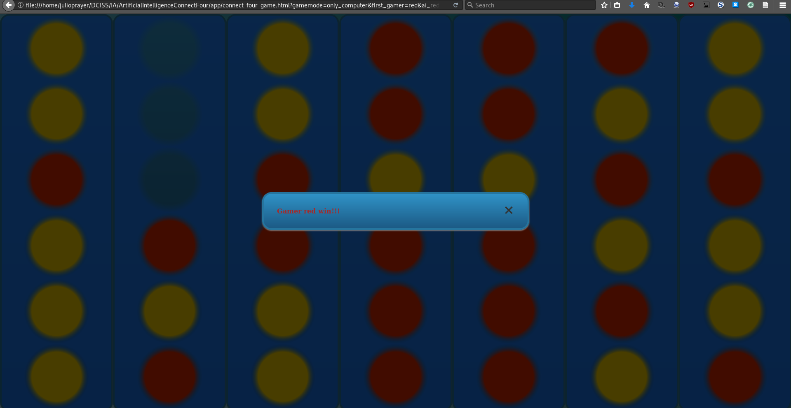

### Statistics

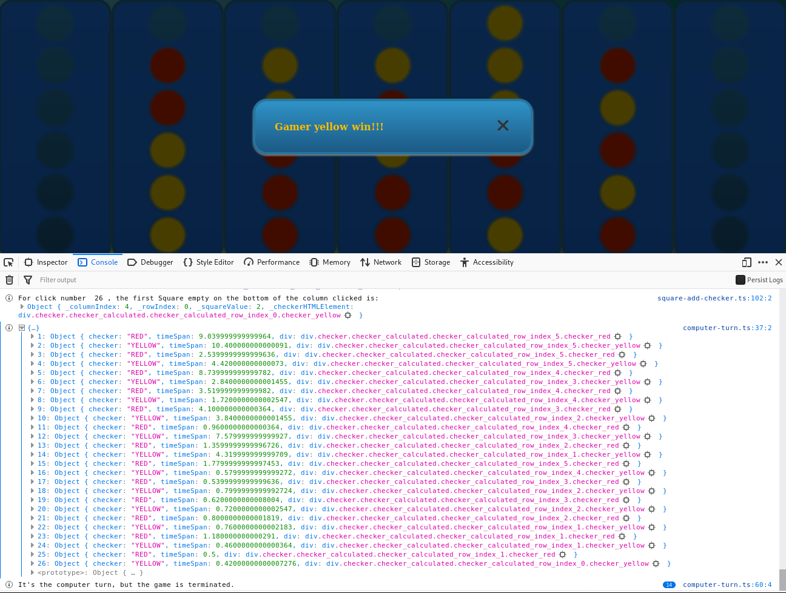

\newpage
### index.html

<!--
91 % otherwise a new page is inserted before the image with the template
`eisvogel.tex`
-->
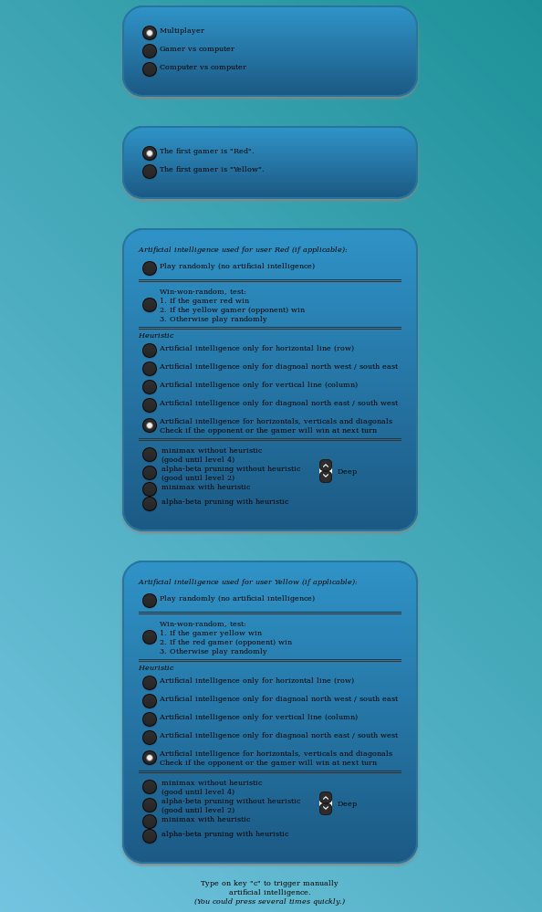{ height=90% }

### Artificial intelligence examples

#### Heuristic example (deep 1)


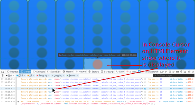

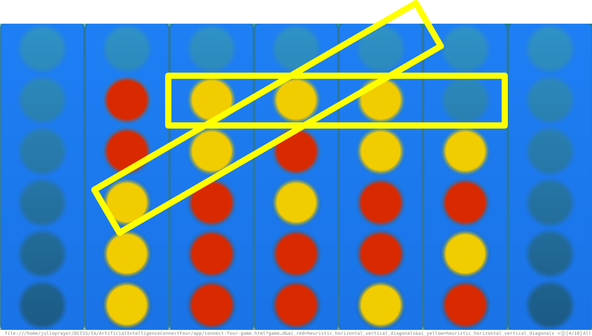

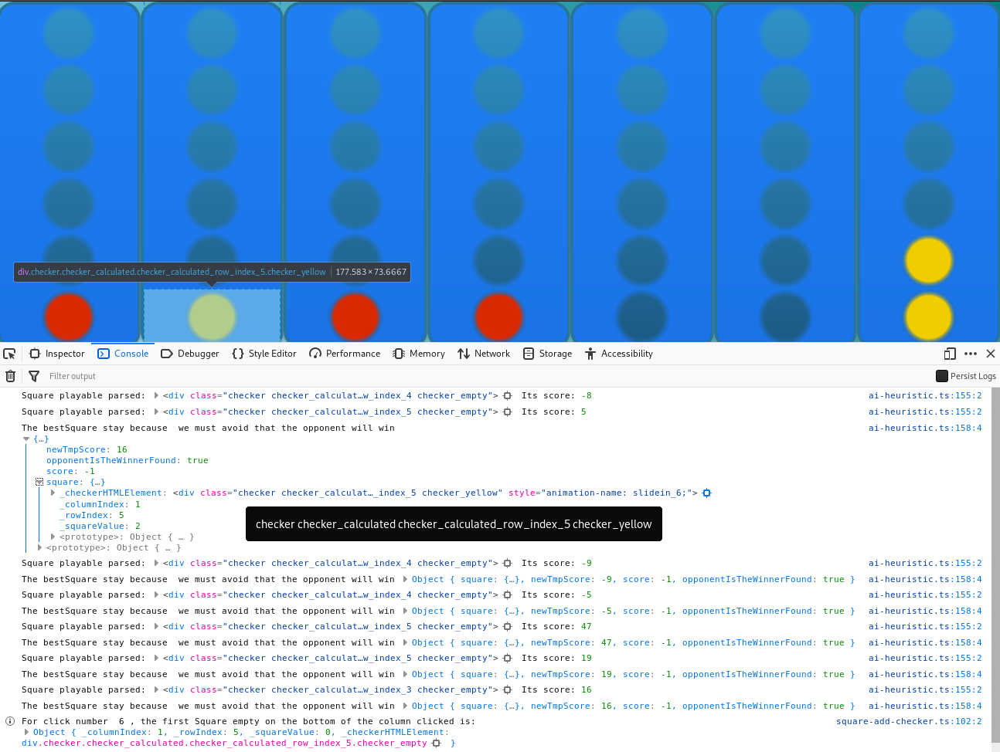


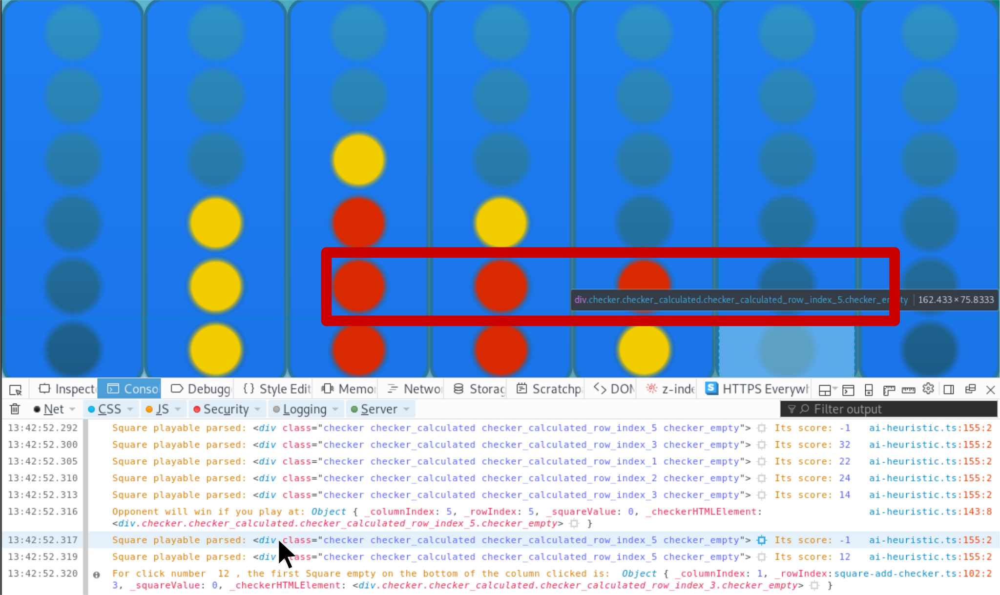

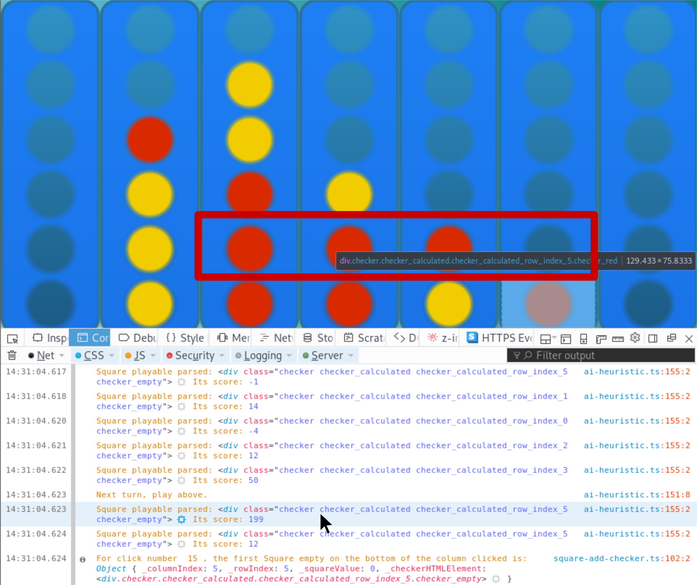

#### Minimax example

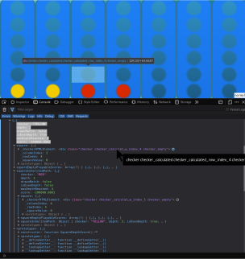

## Algorithmes

### Minimax without heuristic

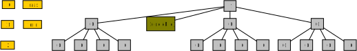

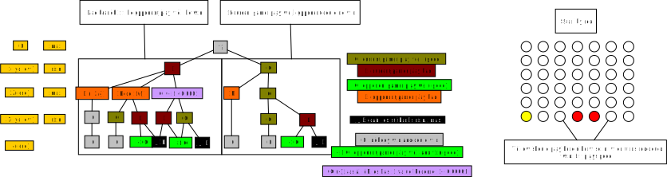

### Heuristic

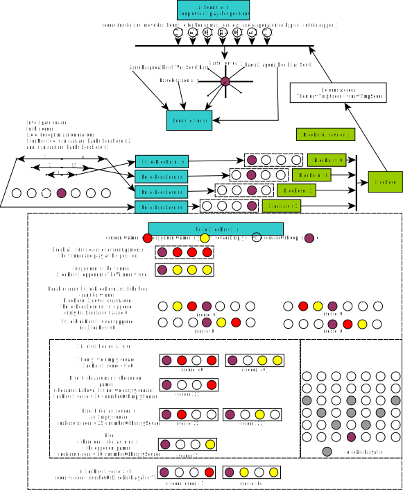

### Alpha-bêta pruning

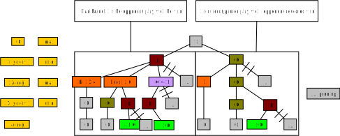

## Table des illustrations

<!-- \listfigurename -->
<!-- https://tex.stackexchange.com/questions/82993/how-to-change-the-name-of-document-elements-like-figure-contents-bibliogr -->
\renewcommand{\listfigurename}{}

<!-- See https://tex.stackexchange.com/questions/55080/how-to-hide-the-table-of-contents-heading -->
\begingroup
\let\clearpage\relax
\vspace{-1cm}
\listoffigures
\endgroup

\newpage

## Bibliographie

<!-- Auto generated -->

<!-- Notes de fin -->

[^1]: Dans le cas où le transiplateur TypeScript ne « Polyfill » pas,
i.e. s'il ne transforme pas le code dans une version EcmaScript inférieure.
